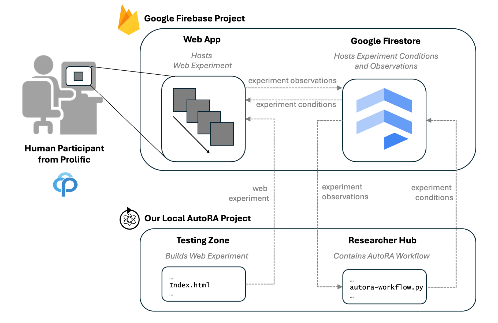
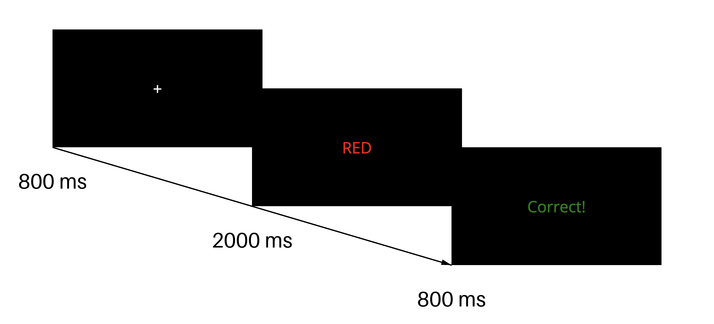

<style> 
    header {
            right: 20px;
            text-align: right;
            font-size: 24pt;
        }

    img {
        display: block;
        margin: 0 auto;
    }
    
    .stroop-overview {
        width: 50%;
    }

    .autora-overview {
        width: 85%;
    }

    .colored {
        background: #222;
        padding: 4pt 12pt;
        font-weight: bold;
        border-radius: 2pt;
    }

    .colored.blue {
        color: blue
    }

    .colored.red {
        color: red
    }

</style>

# ASDMB Tutorial: Basics
> Today: Setting Up The Loop

---

# Content

> [Logistics](#logistics)
> [Overview](#overview-what-are-we-building)
> [Tutorial](#tutorial-setup)

---

## Logistics

- *Earlier* (before 7:00 pm) Tutorials on *Tools*
- *Late* (after 20:00 pm) Tutorials on *AutoRA Integration*
- *Office Hours*: I'm here in front of A32 or in my office, second floor 23.
- *What to do if you get stuck*: [troubleshooting.md](troubleshooting.md) is a guide on how to continue at the start of each tutorial

---


# Overview: What are we building?
> [Study](#study)
> [AutoRA System](#autora-system)

---

## Study

In this example study, we are interested in **cognitive control**. To examine this, we will use a **Stroop Task**, in which participants see color words displayed in different ink colors and must respond to the color rather than the word’s meaning. Performance is compared between *congruent* trials (e.g., the word <span class="colored red">RED</span> shown in red) and *incongruent* trials (e.g., the word <span class="colored blue">RED</span> shown in blue), allowing us to measure accuracy differences that reflect congruency effects.

--- 

<style scoped>
    {
        background-color: black;
    }
</style>


---

<style scoped>
    h2 {
        display: None;
    }
    </style>

## AutoRA System



---

## Tutorial: Setup

---

### Prerequisits

- Google Account (personal with org access)
- GitHub Account

---

<style> 
.github-button {
    padding: 8px 12px;
    border-radius: 4px;
    background: #248536;
    color: white;
}
</style>

### Creating the Repository

1. Go to [https://github.com/younesStrittmatter/ASDMB-Tutorial-Basics](https://github.com/younesStrittmatter/ASDMB-Tutorial-Basics) and use as template. Top-right-corner: <span class="github-button">Use this template ▼</span> → Create a new repository
2. Open the repository in Codespaces: <span class="github-button"><> Code ▼</span> → Codespaces 


---
### Virtual Environment

Create a virtual environment (in the terminal):

```shell
python -m venv .venv
```

Activate the environment:

```shell
source .venv/bin/activate
```

Add .gitignore to root folder with entry .venv:
```file
.venv
```

---
### Cookiecutter: Set Up

Install cookiecutter
```shell
pip install cookiecutter
```

Use cookiecutter to set up the project
```shell
cookiecutter https://github.com/AutoResearch/autora-user-cookiecutter
```

alternative:
```shell
python -m cookiecutter https://github.com/AutoResearch/autora-user-cookiecutter
```

---

Cookiecutter: Configuration

- Give your project a name (short, no special characters)
- [?] Do you want to use advanced features?: > yes
- [?] Do you want to install theorists: no theorist (continue)
- [?] Do you want to install experimentalists: no experimentalist (continue)
- [?] Do you want to install experiment-runners: select `[X] autora[experiment-runner-firebase-prolific]` with the spacebar
- [?] Do you want to set up a firebase experiment? (ATTENTION: Node is required for this feature): > yes
- If asked, install the packages (write `y` and continue)

---

- [?] What type of project do you want to create?: > Double Sweet
- Enter your Firebase project ID: Can be same as project name
- ? Enable Gemini in Firebase features? (Y/n) -> `n`
- ? Allow Firebase to collect CLI and Emulator Suite usage and error reporting information? `n` (or Y if you like to)
- If asked to login, follow the instructions

---

### Project Structure
> [Testing Zone](#testing-zone)
> [Researcher Hub](#researcher-hub)

---

####  Testing Zone
>Path: <project_name>/testing_zone

This is the participant-facing website, implemented mainly in JavaScript.

No changes are needed here (**you don’t have to write any JavaScript**).

For advanced users:
If you prefer not to use SweetBean (Python) and would rather use a frontend library like [jsPsych](https://www.jspsych.org/latest/) to generate stimuli, you can customize the file `testing_zone/src/design/main.js` to fit your needs

---

#### Researcher Hub
>Path: <project_name>/researcher_hub

This is the researcher-facing workspace, where you will write all of your code.


---

#### AutoRA State
AutoRA operates on a state object that holds all data relevant to a study, including:

- *Variable definitions*
- *Experimental conditions*
- *Experimental data*
- *Fitted models*

---

#### AutoRA Modules

The state is passed between agents, each acting on it in different ways.
AutoRA defines three core agents mainly defined by their output (but you can extend this with your own):

- *Experimentalist*: Creates new experimental conditions or experiments (may use variable definitions, data, or fitted models).
- *Theorist*: Proposes and fits models (primarily uses experimental data).
- *Experiment Runner*: Takes experimental conditions and generates new data (for example by runninge the experiments on synthetic models or online on real participants)

---

## Our First Study

**💡 Idea (Theory)**
Do people adapt their cognitive control depending on the context?

<br>

**🧪 Manipulation (Test)**
Does the frequency of congruent vs. incongruent trials influence the size of the congruency effect?

---

### Variables

**IV**:

*congruency_frequency*: (.1, .2, ..., .0)

**DV**:

*congruency_effect (difference beetween RTs)*: (-2000, 2000)

---

```python
variables = VariableCollection(
    independent_variables=[
        Variable(
            name="congruency_freq", 
            allowed_values=[25, 50, 75])
        ],
    dependent_variables=[
        Variable(
            name="congruency_effect", 
            value_range=(-100, 100))
        ]
    )
```
---

## Theorist

Linear regression: `congruency_effect ~ congruency_frequency`

---

## Experimentalist

Randomly chose `congruency_frequency` from `allowed_values`

---

## Experiment Runner: SweetPea

SweetPea: Trial Sequences

(1) Regular Factors: *word*, *color*
(2) Derived Factor: *congruency* 

**Manipulation:**

*weight* of congruent vs incongruent trials

---

```python
color = Factor('color', ['red', 'green'])
word = Factor('word', ['RED', 'GREEN'])

congruency = Factor(
    'congruency', 
        [
            DerivedLevel('congruent',
                         WithinTrial(lambda x, y: x.lower() == y.lower(), [color, word]),
                         weight=int(row['congruency_freq'] / 25)),
            DerivedLevel('incongruent',
                         WithinTrial(lambda x, y: x.lower() != y.lower(), [color, word]),
                         weight=int(4 - row['congruency_freq'] / 25)),
        ]
    )    

design = [color, word, congruency]
crossing = [color, congruency]
constraints = []
```

---

## Experiment Runner: SweetBean



---

```python
seq = [
        Fixation(duration=800),
        Text(
            duration=2000,
            text=TimelineVariable('word'),
            color=TimelineVariable('color'),
            correct_key=FunctionVariable(
                name='correct_key',
                fct=lambda x: 'f' if x == 'red' else 'j',
                args=[TimelineVariable('color')]),
            choices=['f', 'j']),
        Feedback(duration=800)
        ]
```

---

## Postprocessing The Data

trial data -> table with *IVs* and *DVs*

---

```python
df.to_csv("sample.csv")
    
df['congruent'] = df['bean_text.1'].str.lower() == df['bean_color.1'].str.lower()

grouped = df.groupby('exp_id')

con_acc = df[df['congruent']].groupby('exp_id')['bean_correct.1'].mean()
inc_acc = df[~df['congruent']].groupby('exp_id')['bean_correct.1'].mean()

# Fill this with ivs and dvs
summary = pd.DataFrame({
    'congruency_freq': grouped['congruent'].mean() * 100,
    'congruency_effect': con_acc * 100 - inc_acc * 100,
})

```


